# Teamprojekt Autonomes Fahren mit dem Turtlebot3
Ziel dieses Projekts ist die autonome Steuerung eines Roboters auf einer festgelegten Strecke. Dabei soll der Roboter Verkehrsschilder erkennen und darauf reagieren. Zudem soll der Roboter einer markierten Fahrbahn folgen.

Das Projekt hat zwei weitere Unterprojekte, welche man unter folgenden Links findet:
- https://github.com/betaros/LineFollower (auch "lane assist" genannt)
- https://github.com/Luk4s93/TB3Movement

## Inhalt
- [Roboter](#roboter)
- [Strecke](#strecke)
- [Schilderkennung](#schilderkennung)
	- [Verkehrsschilder](#verkehrsschilder)
	- [Funktionsweise](#funktionsweise)
	- [Haar Cascaden](#haar-cascaden)
- [Straßenerkennung](#straßenerkennung)
- [Steuerung des Roboters](#steuerung-des-roboters)
- [ROS](#ros)
    - [Vorraussetzungen](#vorraussetzungen)
	- [Package erstellen](#package-erstellen)
	- [Subscriber](#subscriber)
    - [Publisher](#publisher)
    - [Projekt starten](#projekt-starten)
- [Quellen](#quellen)

## Roboter
Bei dem Roboter handelt es sich um einen Turtlebot 3 Burger. Dieser ist Open Source und wurde entwickelt bei Willow Garage von Melonee Wise und Tully Foote. Er dient als günstiger Einstieg in die Welt der Robotik und ist durch seinen modularen Aufbau leicht zu erweitern. Der verwendete Roboter wurde frontal um eine Raspberry Cam erweitert, um dadurch Verkehrsschilder und die Strecke erkennen zu können.

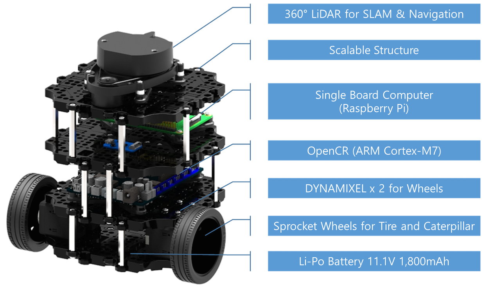
https://spectrum.ieee.org/image/Mjg5Mzk3MQ.png

## Strecke
Die verwendete Strecke orientiert sich am [Turtlebot3 Autorace](http://emanual.robotis.com/docs/en/platform/turtlebot3/autonomous_driving/#autonomous-driving) Projekt. Dies ist ein Wettbewerb, bei dem verschiedene Teams gegeneinander mit Turtlebot3 eine definierte Strecke abfahren und auf Schilder reagieren. Anfangs bestand Unklarheit, ob der Turtlebot auf einer schwarzen (Teer-ähnlichen) oder weißen (günstiger zu produzierbaren) Miniatur-Straße fahren soll, und ob mit oder ohne expliziter Spurbegrenzung; es wurde sich aus Kostengründen für eine weiße Straße mit bunter Spurbegrenzung entschieden. Die Strecke ist eine farbangepasste Rekonstruktion jener, die im Turtlebot3 Autorace Projekt genutzt wurde. Die Strecke befindet sich auf einem weißen Untergrund.


http://emanual.robotis.com/assets/images/platform/turtlebot3/autonomous_driving/autorace_map.png

## Schilderkennung

### Verkehrsschilder
Die in dem Projekt verwendeten Verkehrsschilder sind Modellverkehrsschilder

Bild | Name | Verhalten
-----|------|----------
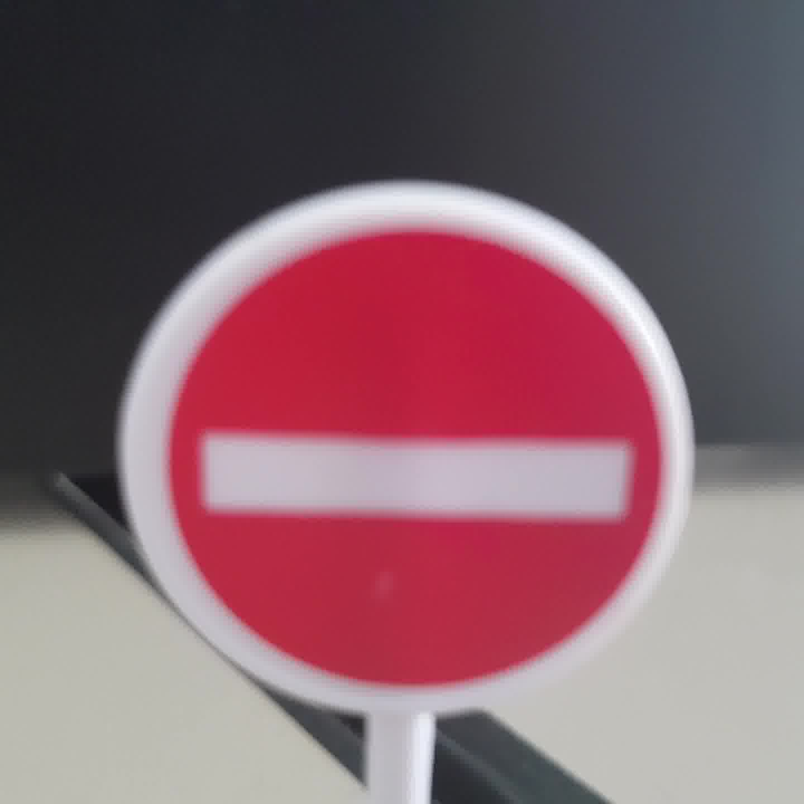 | entry_forbidden |
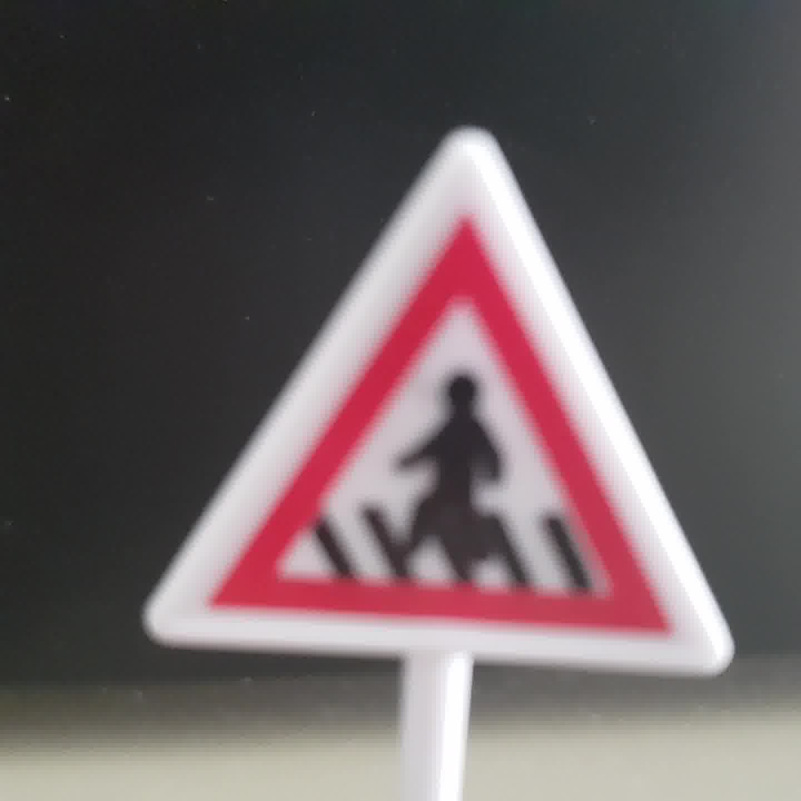 | pedestrians |
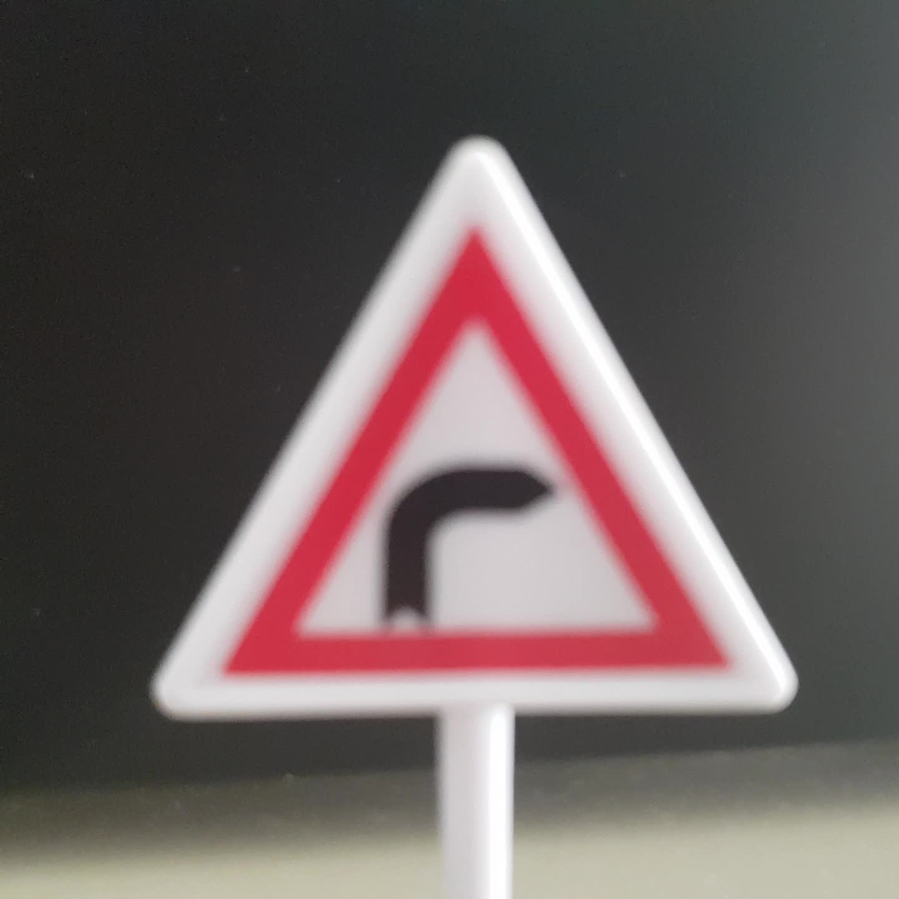 | turn_right |
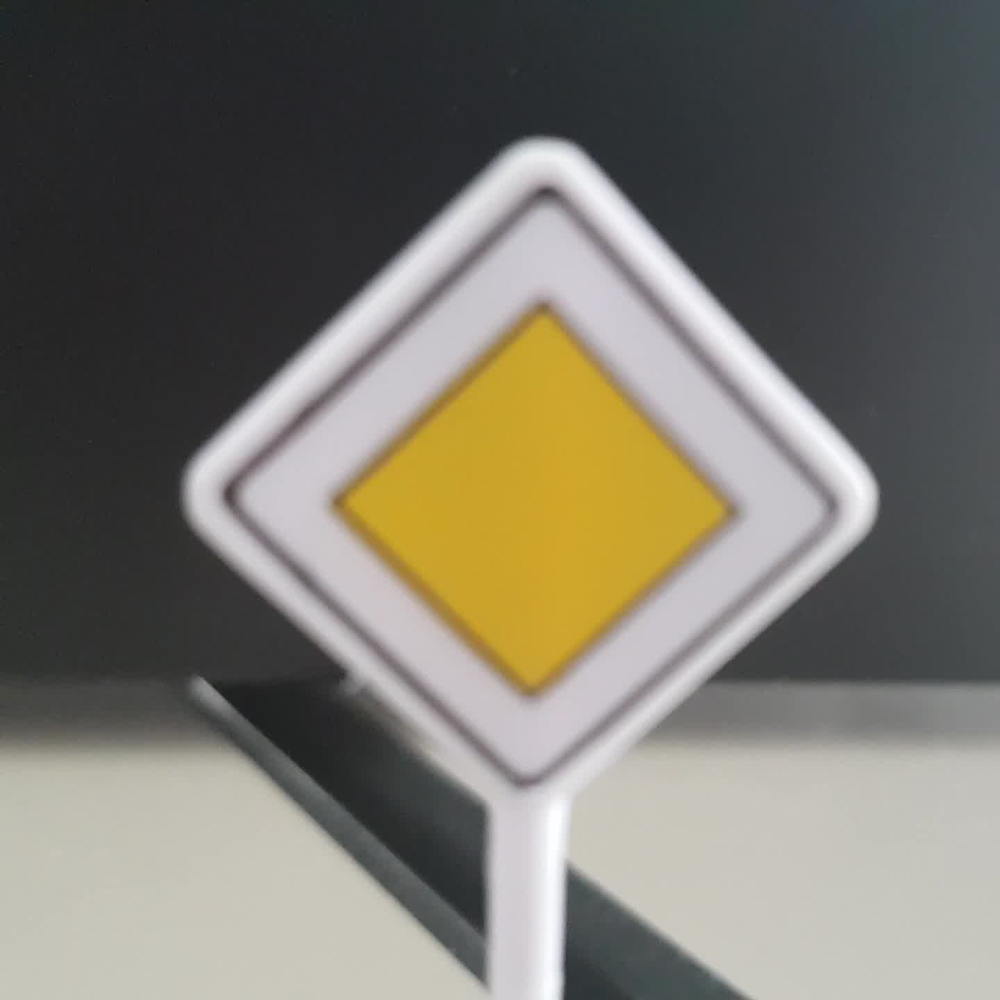 | main_road |
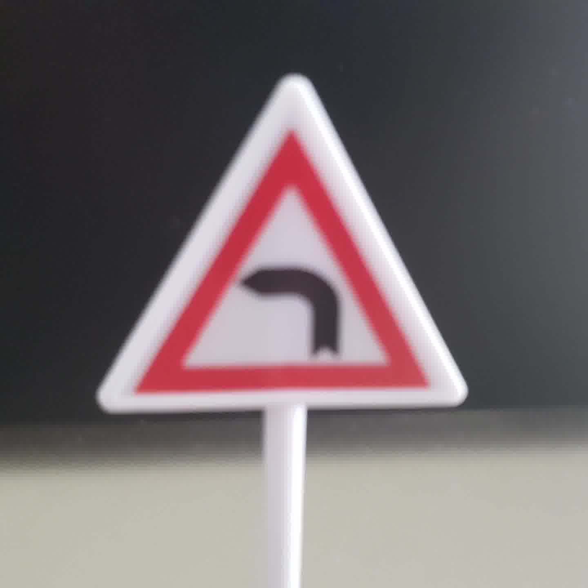 | turn_left |
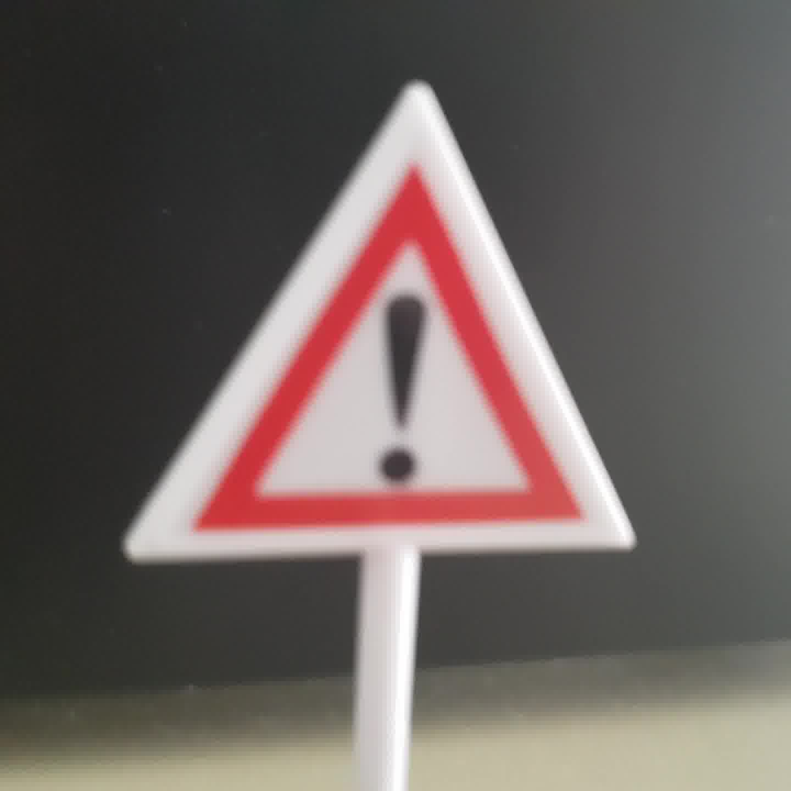 | warning |
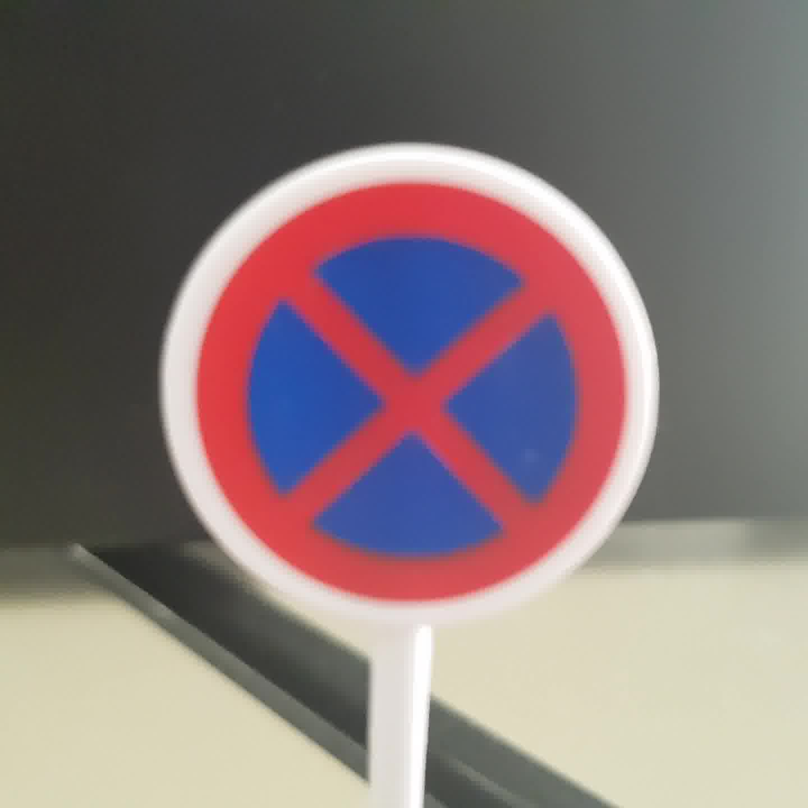 | no_parking |
 | bus_stop |
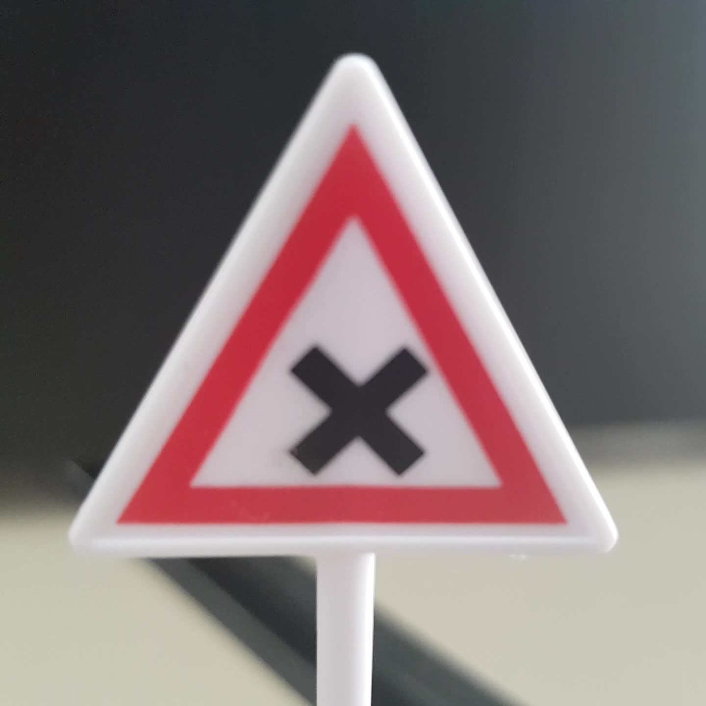 | crossing |
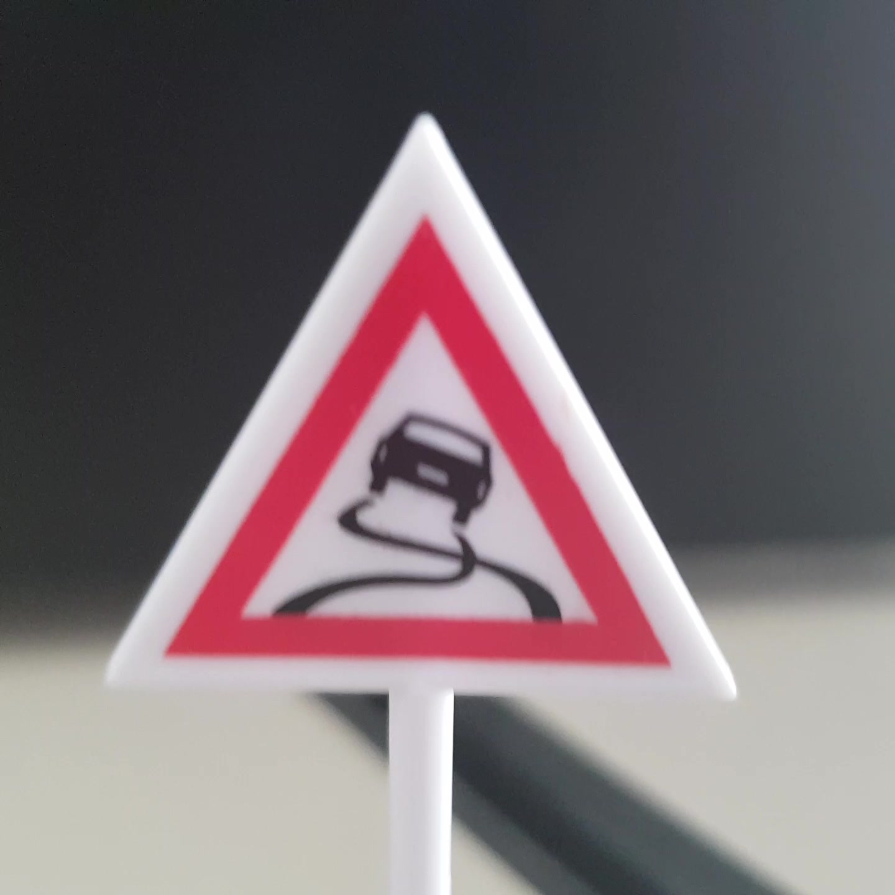 | slippery |
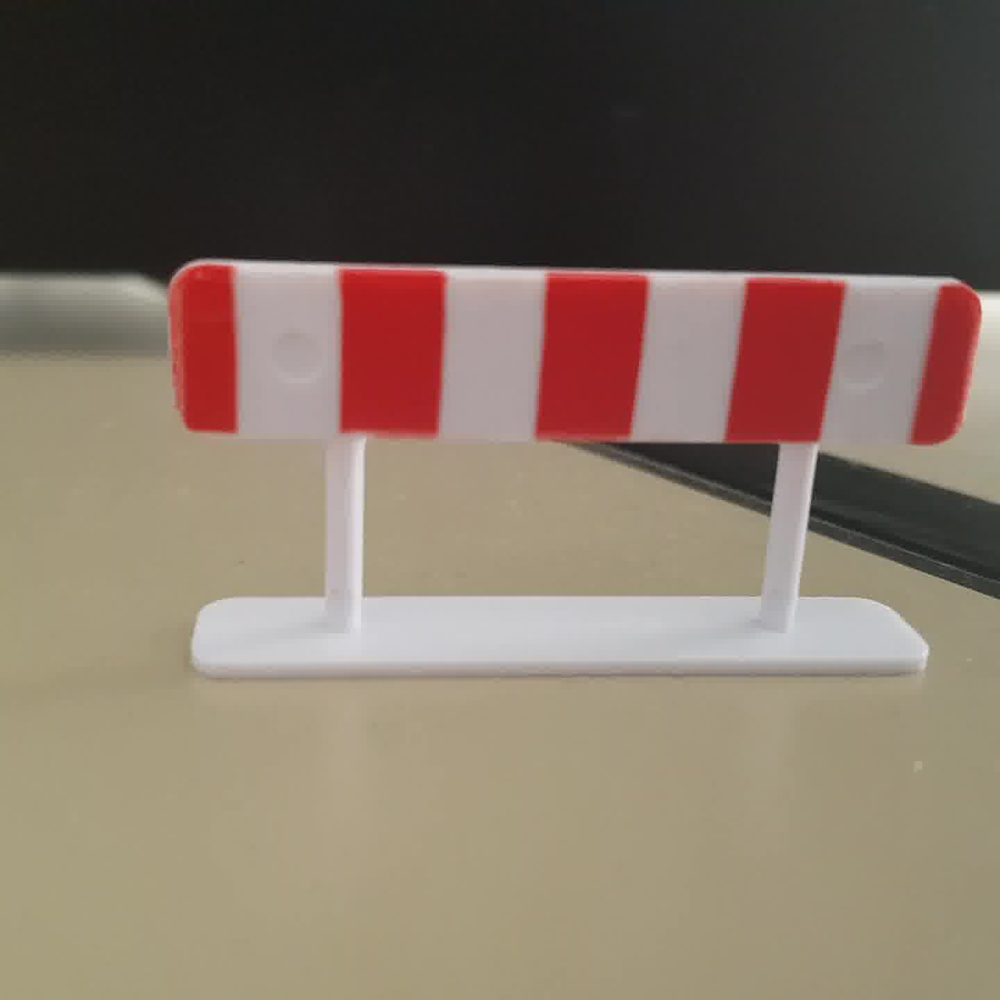 | entry_road_closed |

### Funktionsweise
Um in einem Foto ein Verkehrsschild erkennen zu können werden *Haar Cascaden* verwendet. Dies sind XML-Dateien, auch "Cascaden" genannt, welche Daten zur Mustererkennung beinhalten. Der Algorithmus zur Erzeugung dieser Cascaden wird auch Viola-Jones-Methode genannt ([siehe Wikipedia](https://de.wikipedia.org/wiki/Viola-Jones-Methode)).

Die Erkennung von Verkehrsschildern erfolgt in zwei Schritten. Dabei wird zuerst eine Cascade verwendet, um die Form des Verkehrsschildes zu erkennen und danach eine, welche den Inhalt versucht zu erkennen. Daraus wird darauf geschlossen, welches Verkehrsschild sich vor dem Roboter befindet.

### Haar Cascaden
Man kann Haar Cascaden mit OpenCV selbst erstellen. Dabei benötigt man einen Datensatz mit negativen Bildern, also Bildern auf denen sich das zu erkennende Objekt nicht befindet.

Außerdem wird ein positives Bild benötigt. Dies wird dann auf auf die negativen Bildern gelegt und unterschiedlich verzerrt. Mit diesem Schritt werden aus den negativen Bildern positive Bilder. Es sollten mindestens doppelt so viele negative Bilder vorhanden sein, wie positive Bilder.

Es gibt zwei detaillierte Anleitungen, wie die Erstellung funktioniert. Diese findet man im Abschnitt [OpenCV in den Quellen](#opencv).

## Straßenerkennung

Mit dem Ziel, dass der Turtlebot auf einer Miniatur-Straße fahren und dem Streckenverlauf folgen kann, wurde zudem an einer Straßenerkennung mit aktiven Spurhalteassistenten gearbeitet (intern “lane assist” genannt).

Anforderungen:

- ein **Verlassen** der Straßen beim Vorwärtsfahren soll **vermieden** werden
- **Kurven** im Straßenverlauf soll gefolgt werden
- die Erkennung soll in **Echtzeit** laufen
- eine gestrichelte Spurbegrenzung soll als Indikator eines **Parkplatzes** erkannt werden
- bei einer Straßen-Gabelung oder -Kreuzung dem Straßenverlauf beliebig folgen.
- (optional) eine Kalibrierung je nach Licht- und Sichtverhältnissen soll ohne großen Aufwand möglich sein.

Außerhalb des Rahmens dieser Anwendung ist u.a.:

- Straßen-Gabelungen und -Kreuzungen erkennen
- eingeschränkte Sichtverhältnisse (z.B. durch Regen)
- schwer erkennbare Straßen (z.B. durch grobe Verschmutzung oder Abnutzung der Straße)
- Gegenverkehr
- Strecken mit unterschiedlich aussehenden Straßen (z.B. Wechsel von weißer auf schwarzer Straße)
- Offroad-Fahren


Zum Erkennen der Straße bietet sich die am Turtlebot angebrachte Front-Kamera an. Das Bild-Verarbeiten kann zusammen mit anderen Anforderungen an den Turtlebot jedoch zu rechenintensiv sein; um die Echtzeit-Erkennung gewährleisten zu können, wird deshalb das Kamera-Bild des Turtlebots über ein lokales WLAN-Netzwerk an einen separaten Computer übermittelt. Die ausgewerteten Informationen werden in einer separaten Anwendung genutzt um den Turtlebot zu steuern.

Der Algorithmus besteht aus zwei Schritten: der Foto-Aufbereitung und der Foto-Analyse. In der Foto-Aufbereitung wird das Foto vom Turtlebot empfangen, dekodiert, ggf. richtig gedreht. Um resistenter gegen Unebenheiten, Rauschen im Bild und Verschmutzung der Straße zu sein, wird ein Weichzeichen auf das Bild angewandt, hierbei stellte sich ein “Median Blur” als effektiv heraus.

Da angenommen wird, dass der Turtlebot auf einer Straße startet (und bei erfolgreicher Spurhaltung dort bleibt) wird davon ausgegangen, dass am mittleren-unteren Rand des Bildes noch die Straße erkennbar ist. Der Straßenrand in beliebiger Richtung sollte durch deutlichen Helligkeits-Übergang erkennbar sein, soweit dieser noch innerhalb der Maße des Fotos ist. Ausgehend von der Mitte des Bildes wird zeilenweise horizontal in beide Richtungen (links & rechts) iteriert, bis ein Helligkeits-Übergang (und somit Straßenrand) erkannt wird; da die Front-Kamera mittig am Turtlebot angebracht ist, kann anhand dieser Werte auch erkannt werden, wie mittig er fährt, über der Differenz zwischen der Mitte des Bildes und der Mitte zwischen dem linken und dem rechten Straßenrand. Sich vertikal ändernde Straßen-Mitten lassen auch auf Verlaufsänderungen, d.h. Kurven, schließen. Neben dem Fall, dass beide Straßenränder parallel verlaufen, gibt es aber auch noch Sonderfälle.

Ein solcher Sonderfall ist, dass beide Straßenränder unterschiedlich verlaufen, wie z.B. bei einer Straßen-Kreuzung oder -Gabelung; hier fallen beide Straßenränder mit unterschiedlichen Verläufen auf. Dies könnte theoretisch auch explizit erkannt und der gemeldet werden, damit die Fahrplan-Logik dementsprechend Entscheidungen treffen kann; da dies außerhalb des Umfanges dieser Arbeit liegt, wird stattdessen eine der möglichen Optionen des Abbiegens oder Geradeausfahrens gewählt.

Es besteht der Sonderfall, in dem entweder nur der linke oder der rechte Straßenrand auf dem Foto erkennbar ist, z.B. könnte in einer Rechtskurve der rechte Rand außerhalb des Bildbereiches liegen; dies tritt auch in einer Straßen-Gabelung auf. In diesem Fall wird statt dem Verlauf der Straßenmitte der Verlauf des noch sichtbaren Straßenrandes genutzt: verläuft dieser geradlinig (wie in einer Verzweigung), so wird standardmäßig weiter geradeaus entlang der Straße gefahren. Verläuft dieser kurvenförmig, so wird dieser Kurve gefolgt.

Der letzte Sonderfall ist, dass kein Straßenrand erkannt wird. Da im Rahmen dieser Arbeit sowohl die Straße als auch der Offroad-Untergrund weiß sind, kann hierbei nicht unterschieden werden der Turtlebot nun on- oder offroad ist. Tendenziell wird versucht geradeaus weiterzufahren, um im Falle vorübergehender Fehlerkennungen nicht stecken zu bleiben; generell ist das Verhalten in diesem Fall jedoch undefiniert, da es außerhalb des rein-weißen Untergrunds zu False-Positives bei der Erkennung des Straßenrandes kommen kann.


## Steuerung des Roboters
*TODO*

## ROS
>Robot Operating System (ROS) ist ein Software-Framework für persönliche Roboter. Die Entwicklung begann 2007 am Stanford Artificial Intelligence Laboratory im Rahmen des Stanford-AI-Robot-Projektes (STAIR) und wurde ab 2009 hauptsächlich am Robotikinstitut Willow Garage weiterentwickelt. Seit April 2012 wird ROS von der neu gegründeten, gemeinnützigen Organisation Open Source Robotics Foundation (OSRF) unterstützt und seit Beendigung der operativen Tätigkeit von Willow Garage 2013 von dieser koordiniert, gepflegt und weiterentwickelt. Seit 2013 beschäftigt sich das ROS Industrial Consortium mit der Förderung und Unterstützung von ROS für Anwendungen in der Industrierobotik. In Europa koordiniert das Fraunhofer IPA die Aktivitäten des ROS Industrial Consortium Europe.

https://de.wikipedia.org/wiki/Robot_Operating_System am 16.12.2018 um 12.16 Uhr

### Vorraussetzungen
Damit das Projekt verwendet werden kann, müssen folgende Vorraussetzungen erfüllt sein:
- ROS Kinetic oder höher auf Remote PC
- Turtlebot3 Burger mit ROS Kinetic
- [raspicam_node](https://github.com/UbiquityRobotics/raspicam_node) auf Turtlebot3 installiert
- RemotePC und Turtlebot3 im gleichen WLAN Netzwerk

### Package erstellen

*TODO*


### Subscriber
Damit das Programm die Bilder auswerten und Verkehrsschilder darauf erkennen kann, muss sich das Programm im ROS bei der Raspberry Cam anmelden. Diese liefert die Bilder mittels Videostream.

#### /raspicam_node/image/compressed
Der Videostream wird vom ROS Package raspicam_node bereitgestellt. Daher muss das Programm diesen abonnieren.

### Publisher
Die Verkehrszeichenerkennung hat zwei Ausgabestreams:

- **/traffic_sign/detected**
  Dieser Publisher gibt in einem Textstream, welcher das Verkehrsschild mit dem größten Rahmen als Text für die Weiterverarbeitung ausgibt.
- **/traffic_sign/image/compressed**
  Um das Programm debuggen zu können, wird zusätzlich ein Videostream ausgegeben, in dem die erkannten Verkehrsschilder markiert sind.

Die Straßenerkennung hat folgende zwei Ausgabestreams:

- **/traffic_sign/detected**
  Dieser Publisher gibt in einem Int-Stream, welcher den benötigen Winkel angibt, um dem Straßenverlauf zu folgen.
- **/traffic_sign/image/compressed**
  Um das Programm debuggen zu können, wird zusätzlich ein Videostream ausgegeben, an das vorbereitete Kamera-Bild mit extra Linien überlagert wird, welche die erkannten Straßenränder markieren und den Verlauf erkennen lassen.

### Projekt starten
Damit das Projekt gestartet werden kann, müssen folgende Schritte durchgeführt werden.
1. [RemotePC]

    ```roscore```

2. [Turtlebot3]

    ```roslaunch raspicam_node autorace.launch```

3. [RemotePC]

    ```roslaunch TB3Movement autorace.launch```


## Video
*TODO*

## Quellen
##### Roboter
- http://emanual.robotis.com/docs/en/platform/turtlebot3/overview/
- https://github.com/UbiquityRobotics/raspicam_node

##### OpenCV
- https://pythonprogramming.net/haar-cascade-object-detection-python-opencv-tutorial/
- https://docs.opencv.org/3.3.0/dc/d88/tutorial_traincascade.html
