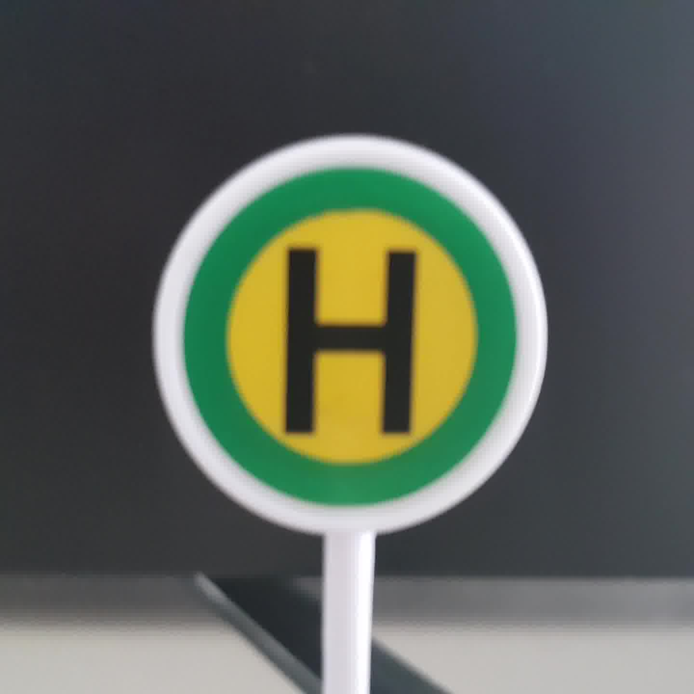

# Teamprojekt Autonomes Fahren mit dem Turtlebot3
Ziel dieses Projekts ist die autonome Steuerung eines Roboters auf einer festgelegten Strecke. Dabei soll der Roboter Verkehrsschilder erkennen und darauf reagieren. Zudem soll der Roboter einer markierten Fahrbahn folgen.

Das Projekt hat zwei weitere Unterprojekte, welche man unter folgenden Links findet:
- https://github.com/betaros/LineFollower
- https://github.com/Luk4s93/TB3Movement

## Inhalt
- [Roboter](#roboter)
- [Strecke](#strecke)
- [Schilderkennung](#schilderkennung)
	- [Verkehrsschilder](#verkehrsschilder)
	- [Funktionsweise](#funktionsweise)
	- [Haar Cascaden](#haar-cascaden)
- [Strassenerkennung](#strassenerkennung)
- [Steuerung des Roboters](#steuerung-des-roboters)
- [ROS](#ros)
    - [Vorraussetzungen](#vorraussetzungen)
	- [Package erstellen](#package-erstellen)
	- [Subscriber](#subscriber)
    - [Publisher](#publisher)
    - [Projekt starten](#projekt-starten)
- [Quellen](#quellen)

## Roboter
Bei dem Roboter handelt es sich um einen Turtlebot 3 Burger. Dieser ist Open Source und wurde entwickelt bei Willow Garage von Melonee Wise und Tully Foote. Er dient als günstiger Einstieg in die Welt der Robotik und ist durch seinen modularen Aufbau leicht zu erweitern. Der verwendete Roboter wurde um eine Raspberry Cam erweitert, um dadurch Verkehrsschilder und die Strecke erkennen zu können.


https://spectrum.ieee.org/image/Mjg5Mzk3MQ.png

## Strecke
Die verwendete Strecke orientiert sich am [Turtlebot3 Autorace](http://emanual.robotis.com/docs/en/platform/turtlebot3/autonomous_driving/#autonomous-driving) Projekt. Dies ist ein Wettbewerb, bei dem verschiedene Teams gegeneinander mit Turtlebot3 eine definierte Strecke abfahren und auf Schilder reagieren.


http://emanual.robotis.com/assets/images/platform/turtlebot3/autonomous_driving/autorace_map.png

## Schilderkennung

### Verkehrsschilder
Die in dem Projekt verwendeten Verkehrsschilder sind Modellverkehrsschilder

Bild | Name | Verhalten
-----|------|----------
 | entry_forbidden |
 | pedestrians |
 | turn_right |
 | main_road |
 | turn_left |
 | warning |
 | no_parking |
 | bus_stop |
 | crossing |
 | slippery |
 | entry_road_closed |

### Funktionsweise
Um in einem Bild ein Verkehrsschild erkennen zu können werden Haar Cascaden verwendet. Dies sind XML-Dateien, auch Cascaden genannt, welche Daten zur Mustererkennung beinhalten. Der Algorithmus zur Erzeugung dieser Cascaden wird auch Viola-Jones-Methode genannt ([siehe Wikipedia](https://de.wikipedia.org/wiki/Viola-Jones-Methode)).

Die Erkennung von Verkehrsschildern erfolgt in zwei Schritten. Dabei wird zuerst eine Cascade verwendet, um die Form des Verkehrsschildes zu erkennen und danach eine, welche den Inhalt versucht zu erkennen. Daraus wird darauf geschlossen, welches Verkehrsschild sich vor dem Roboter befindet.

### Haar Cascaden
Man kann Haar Cascaden mit OpenCV selbst erstellen. Dabei benötigt man einen Datensatz mit negativen Bildern, also Bildern auf denen sich das zu erkennende Objekt nicht befindet.

Außerdem wird ein positives Bild benötigt. Dies wird dann auf auf die negativen Bildern gelegt und unterschiedlich verzerrt. Mit diesem Schritt werden aus den negativen Bildern positive Bilder. Es sollten mindestens doppelt so viele negative Bilder vorhanden sein, wie positive Bilder.

Es gibt zwei detaillierte Anleitungen, wie die Erstellung funktioniert. Diese findet man im Abschnitt [OpenCV in den Quellen](#opencv).

## Strassenerkennung
*TODO*

## Steuerung des Roboters
*TODO*

## ROS
>Robot Operating System (ROS) ist ein Software-Framework für persönliche Roboter. Die Entwicklung begann 2007 am Stanford Artificial Intelligence Laboratory im Rahmen des Stanford-AI-Robot-Projektes (STAIR) und wurde ab 2009 hauptsächlich am Robotikinstitut Willow Garage weiterentwickelt. Seit April 2012 wird ROS von der neu gegründeten, gemeinnützigen Organisation Open Source Robotics Foundation (OSRF) unterstützt und seit Beendigung der operativen Tätigkeit von Willow Garage 2013 von dieser koordiniert, gepflegt und weiterentwickelt. Seit 2013 beschäftigt sich das ROS Industrial Consortium mit der Förderung und Unterstützung von ROS für Anwendungen in der Industrierobotik. In Europa koordiniert das Fraunhofer IPA die Aktivitäten des ROS Industrial Consortium Europe.

https://de.wikipedia.org/wiki/Robot_Operating_System am 16.12.2018 um 12.16 Uhr

### Vorraussetzungen
Damit das Projekt verwendet werden kann, müssen folgende Vorraussetzungen erfüllt sein:
- ROS Kinetic oder höher auf Remote PC
- Turtlebot3 Burger mit ROS Kinetic
- [raspicam_node](https://github.com/UbiquityRobotics/raspicam_node) auf Turtlebot3 installiert
- RemotePC und Turtlebot3 im gleichen WLAN Netzwerk

### Package erstellen

### Subscriber
Damit das Programm die Bilder auswerten und Verkehrsschilder darauf erkennen kann, muss sich das Programm im ROS bei der Raspberry Cam anmelden. Diese liefert die Bilder mittels Videostream.

#### /raspicam_node/image/compressed
Der Videostream wird vom ROS Package raspicam_node bereitgestellt. Daher muss das Programm diesen abonnieren.

### Publisher
Die Verkehrserkennung hat zwei Ausgabestreams.

#### /traffic_sign/detected
Dieser Publisher gibt in einem Textstream, welcher das Verkehrsschild mit dem größten Rahmen als Text für die Weiterverarbeitung ausgibt.

#### /traffic_sign/image/compressed
Um das Programm debuggen zu können, wird zusätzlich ein Videostream ausgegeben, in dem die erkannten Verkehrsschilder markiert sind.

### Projekt starten
Damit das Projekt gestartet werden kann, müssen folgende Schritte durchgeführt werden.
1. [RemotePC]

    ```roscore```

2. [Turtlebot3]

    ```roslaunch raspicam_node autorace.launch```

3. [RemotePC]

    ```roslaunch TB3Movement autorace.launch```

## Video
*TODO*

## Quellen
Roboter
- http://emanual.robotis.com/docs/en/platform/turtlebot3/overview/
- https://github.com/UbiquityRobotics/raspicam_node

OpenCV
- https://pythonprogramming.net/haar-cascade-object-detection-python-opencv-tutorial/
- https://docs.opencv.org/3.3.0/dc/d88/tutorial_traincascade.html
